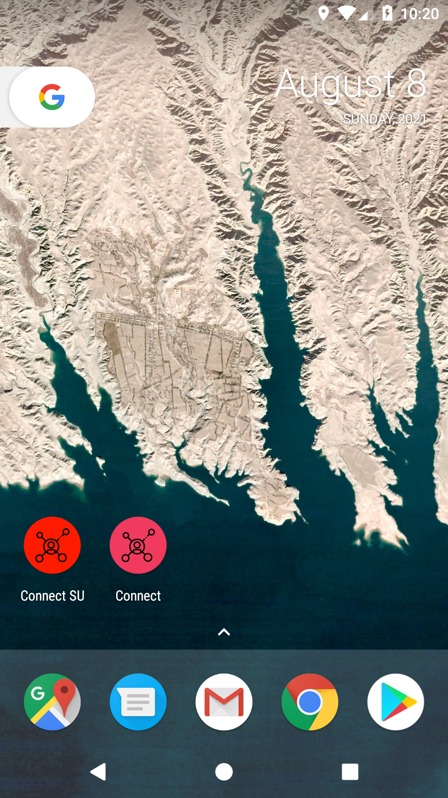
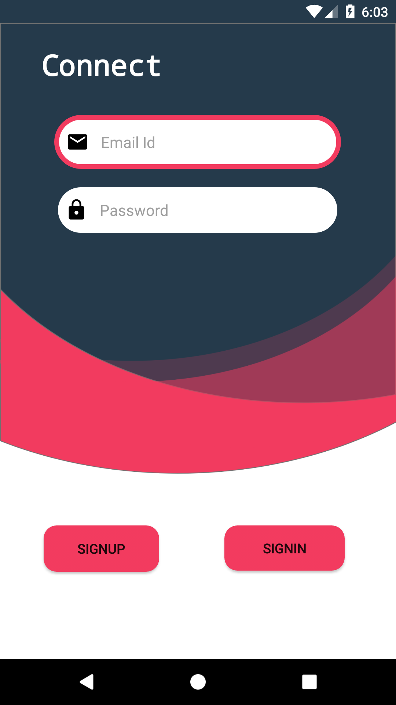
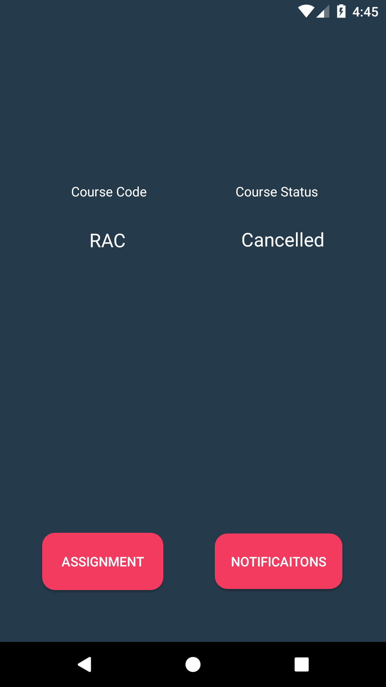
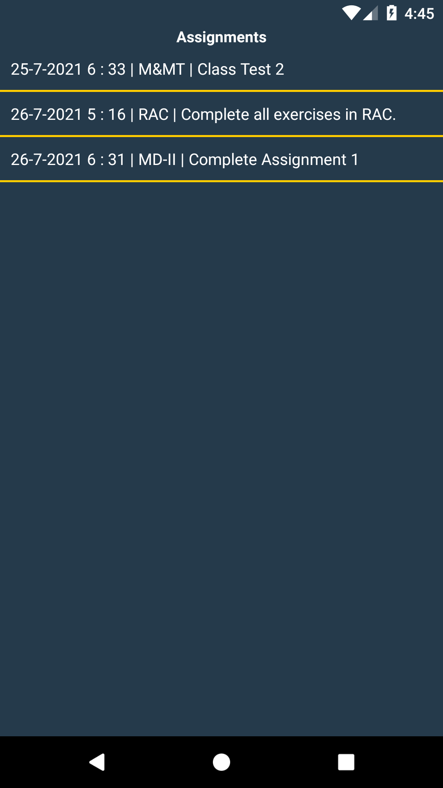
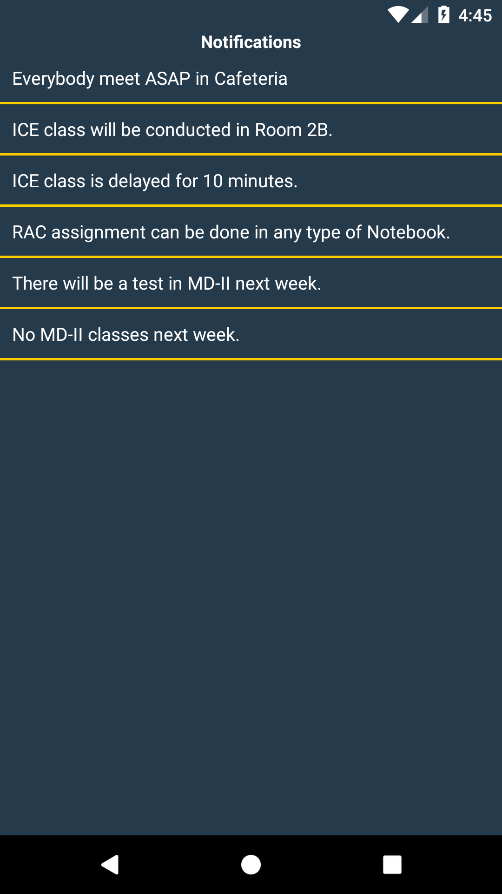

# Connect
“Connect” Centralized Notification and Task Receiving App for students.

## Requirements :
### Android

## Use :
<h1>App Icon</h1>

<h1>LogIn/SignUp</h1>

<h1>Lecture Status</h1>

<h1>Assignments</h1>

<h1>Notifications</h1>
